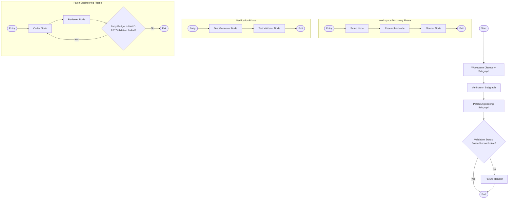

# Multi-Agent GitHub Issue Resolution System 🤖🛠️

An autonomous, hierarchical multi-agent system built with **LangGraph** and **NVIDIA NIM API** (OpenAI-compatible) to analyze, reproduce, and resolve GitHub issues locally. It generates surgical code patches, writes reproduction/regression test suites, and verifies fixes inside an isolated, network-disabled Docker sandbox.

---

## 🏗️ Architecture

The system uses a stateful, hierarchical multi-agent workflow orchestrated by LangGraph. It is split into three main phases, each structured as a state graph (with subgraphs) running under a supervisor:



### 🧑‍💻 The Core Phases & Agents
1. **Workspace Discovery**:
   - **Setup**: Performs initial analysis of the incoming GitHub issue and prepares execution parameters.
   - **Researcher**: Explores the codebase using specialized tools (`search_code`, `read_file`). It uses a fast keyword variant generator and prioritizes search based on path relevance.
   - **Planner**: Outlines a concrete, step-by-step strategy to locate and fix the bug.
2. **Verification (Test-Driven Flow)**:
   - **Test Generator**: Analyzes the problem details and generates reproduction/regression test files.
   - **Test Validator**: Runs the generated tests inside the isolated Docker sandbox to confirm they fail initially. This confirms reproducibility before any code fixes are applied.
3. **Patch Engineering**:
   - **Coder**: Implements code modifications based on the issue description and initial test failures, outputting surgical Unified Diffs.
   - **Reviewer**: Dynamically applies the diff inside the Docker sandbox, runs the test suite, and checks for syntax (AST validity) and runtime errors.
4. **Failure Handler**: If the patch fails validation and the coder retry budget is exhausted, gathers execution details and outputs a failure summary report.

---

## ✨ Key Features

- **Hierarchical LangGraph Workflows**: Orchestrates specialized workflows into subgraphs, keeping states isolated and clean.
- **Test-First Validation**: Ensures bugs are reproducible by executing tests before coder fixes are attempted.
- **Isolated Docker Sandbox**: Applies patches and runs test suites inside a network-disabled Docker container using Git-based baselines to prevent environment pollution.
- **Robust Model Fallback & Downscaling**: Automatically rotates to backup model tiers if a primary model is retired, decommissioned, or meets daily token limits.
- **Token Bucket Rate Limiting**: Tracks TPM/RPM usage in real time, auto-pacing queries to stay within limits.
- **Smart Context Truncation**: Intelligently parses issue templates, preserving stack traces and reproduction steps over verbose prose when nearing token thresholds.
- **Automatic PR Submission**: Generates pull requests directly via the GitHub API once a fix passes verification.

---

## 🛠️ Technology Stack

- **Framework**: [LangGraph](https://python.langchain.com/docs/langgraph) (Stateful multi-actor orchestration)
- **Inference**: Nvidia NIM API (`langchain-openai` wrapper)
- **Isolation/Sandbox**: Docker Engine (python-slim container with Git initialized)
- **User Interface**: [Streamlit](https://streamlit.io/) for dashboard, configuration, live thought trace, and PR submission.
- **State Management**: PostgreSQL (optional state checkpointing setup)

---

## 🚀 Getting Started

### Prerequisites
1. **Python 3.12+**
2. **Docker Engine / Desktop** installed and running.
3. **NVIDIA API Keys** for the configured model tiers (Tier 1-4).

### Installation

1. Clone this repository:
   ```bash
   git clone https://github.com/MJenius/Multi-Agent-Coder.git
   cd Multi-Agent-Coder
   ```

2. Create a virtual environment and install the package and dependencies:
   ```bash
   python -m venv .venv
   # On Windows:
   .venv\Scripts\activate
   # On macOS/Linux:
   source .venv/bin/activate

   pip install -e .
   ```

3. Setup environment variables:
   Copy `.env.example` to `.env` and fill in your API credentials:
   ```bash
   cp .env.example .env
   ```
   *Note: Set your `NVIDIA_API_KEY_TIER1` through `NVIDIA_API_KEY_TIER4` keys in `.env` to enable model fallback tiers.*

4. Spin up the isolated Docker Sandbox:
   ```bash
   docker-compose up -d --build sandbox
   ```

---

## 🎮 How to Run

Launch the Streamlit web dashboard to start resolving issues:

```bash
streamlit run app.py
```

### Streamlit Dashboard Usage
1. Open the local address in your web browser (default: `http://localhost:8501`).
2. In the sidebar, configure:
   - **GitHub PAT** (Personal Access Token with repository write access to submit PRs).
   - **Repository URL** (e.g., `owner/repo`).
   - **Issue Number** (e.g., `12`).
3. Click **🚀 Start Resolution Process**.
4. Monitor the live **Agent Thought Trace** as the Workspace Discovery, Verification, and Patch Engineering phases execute.
5. Once the process completes:
   - If tests pass, view the proposed **Surgical Fix** (diff) and click **🚀 Submit Pull Request** to open a PR on GitHub.
   - If limits are reached without resolution, view the detailed debug logs and final state inspection panel.

---

## 🧪 Development and Testing

Run unit and integration tests locally with `pytest`:

```bash
pytest
```

---

## ⚖️ License

This project is licensed under the MIT License.
